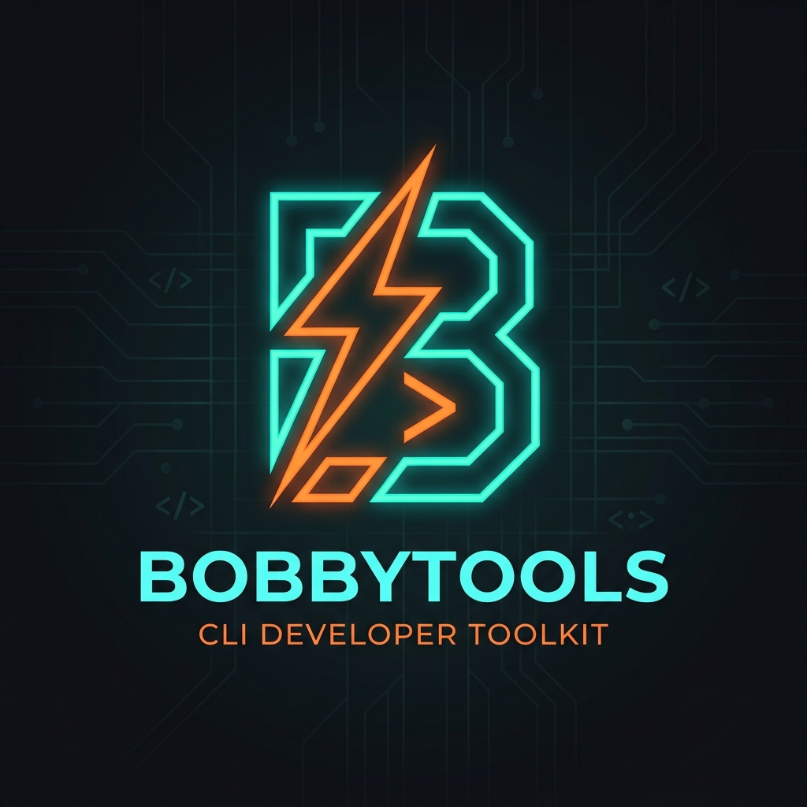

<div align="center">

  
  <br/>

  **Babu Terminal & Universal AI Router.** <br>
  *Karena ngedit `.env` berulang kali itu kerjaan orang kurang kerjaan.*

[](https://www.npmjs.com/package/bobbytools)
[](https://opensource.org/licenses/MIT)

</div>

---

> "Gue nulis kode ini karena capek ngurusin rate limit 429."

Ceritanya gini. Kalo lo pake banyak akun AI gratisan (Groq, Gemini, OpenRouter) atau gonta-ganti API key klien, lo pasti tau rasanya: lagi asik ngoding, kena limit, `stop` terminal, buka `.env`, ganti key, run ulang. Tiap. Lima. Menit. Bikin pengen banting laptop.

Gue bikin **BobbyTools** biar itu gak kejadian lagi. Setup sekali, biarin jalan di background jadi router. Dia yang mikir akun mana yang lagi limit, dia yang muter API key otomatis, dia yang nyari provider cadangan kalo semua mati. Lo tinggal ngoding kayak gak ada yang salah.

Dua cara pake, tinggal pilih sesuai tingkat kemalasan lo hari ini.

---

## ⏱️ Buru-buru? 30 detik jadi

Belum mau baca panjang-panjang, cuma pengen liat ini jalan? Tiga baris:

```bash
npm install -g bobbytools     # 1. pasang (butuh Node 18+)
bobby serve-bg                # 2. nyalain router + browser kebuka sendiri
```

Di browser yang kebuka: **Add Provider** (misal Groq), tambahin API key lo. Terus di terminal ngoding:

```bash
export OPENAI_BASE_URL="http://127.0.0.1:13337/v1"   # Windows PowerShell: $env:OPENAI_BASE_URL="..."
export OPENAI_API_KEY="sk-bobby"                     # diisi apa aja bebas, Bobby yang pegang key asli
opencode -m groq/llama3-70b-8192                     # panggil pake format provider/model
```

Udah. Kena limit 429 di tengah jalan? Bobby muter ke key berikutnya sendiri, lo gak bakal tau. Sisanya di bawah ini kalo lo penasaran. Masih keder? Buka tab **Panduan Lengkap** di dashboard, atau ketik `bobby` terus pilih **Cara Pakai (Tutorial)**.

---

## 🧩 Bobby bisa apa aja

Singkatnya, satu tempat buat semua urusan API key AI lo:

- **Kumpulin banyak akun jadi satu.** Punya 5 key Groq gratisan + 2 OpenRouter + 1 Gemini? Masukin semua. Bobby yang muter giliran (round-robin), lo cukup panggil `groq/llama3-70b-8192`.
- **Anti-limit 429 otomatis.** Satu key kena limit, Bobby diem-diem pindah ke key berikutnya dan retry. Yang kena limit dikasih cooldown, balik aktif sendiri. CLI lo gak pernah tau ada drama.
- **Fallback lintas provider.** Semua key satu provider abis? Bobby nyari provider lain yang punya model sama, pindah mid-request.
- **Penerjemah format.** claude-code (Anthropic) nembak provider OpenAI-style (Groq/OpenRouter), atau ke Gemini, atau ke Responses. Bobby nerjemahin di tengah jalan. Teks, streaming, tool calls, gambar masuk & keluar. Semua arah (gambar keluar: Gemini↔Responses).
- **Combos.** Bikin rantai model cadangan bernama (`ngebut`, `murah-dulu`, dst). Bobby turun ke model berikut cuma kalo yang sekarang bener-bener abis.
- **Bikin gambar juga lewat.** Endpoint Images API (`/v1/images/generations` & `/edits`) diterusin, jadi model image-gen (dall-e, gpt-image, dst) yang dipajang provider lo ikut kena rotasi key + fallback yang sama kayak chat. Tinggal panggil `provider/model`.
- **Login OAuth, bukan cuma API key.** Provider yang gak ngasih key statis (login Google, service account) juga kepake. Sekali klik login di browser, Bobby simpen refresh token-nya, terus dia sendiri yang muterin access token ~1 jam-an di belakang layar. Lo gak pernah pegang token yang cepet basi itu.
- **Dua mode.** Router (server lokal, anti-limit, translator) **atau** launcher klasik (inject key ke env, spawn CLI langsung, tanpa proxy).
- **Dashboard live.** Pantau key mana yang idup/kebakar, countdown cooldown, request per menit, log aktivitas, auto-refresh, gak usah pencet-pencet. Plus penghitung **token** (input/output/cached) per provider & per model. Jalan buat semua format (OpenAI, Anthropic, Gemini, Responses) baik streaming maupun non-streaming. Ada grafik request yang bisa lo geser rentangnya (30 menit / 1 jam / 6 jam / 24 jam), sama peta routing (BobbyTools → provider mana aja). Angka yang berubah nge-*flash* biar keliatan update-nya. Mau tau taksiran **biaya**? Toggle Tokens/Costs: harga OpenRouter keisi otomatis pas Fetch model, sisanya isi manual di Settings.
- **Zero-trust, zero-cloud.** Gak masang cert, gak ada MITM, gak ada telemetry. Key lo cuma nyampe ke provider yang lo daftarin. Router cuma dengerin `127.0.0.1`.

---

## ⚡ Pasang

Butuh Node.js v18 ke atas. Cek dulu: `node -v`. Kalo di bawah 18, update dulu, jangan ngeyel.

```bash
npm install -g bobbytools
```

Udah. Ketik `bobby`, kalo banner-nya muncul berarti beres. Mau mastiin? `bobby -v` buat liat versinya.

**Update.** Gampang, tinggal ketik `bobby update`. Dia ngecek versi terbaru di npm, kalo ada yang baru langsung ditawarin update (tinggal Enter). Males masuk menu? `npm install -g bobbytools@latest` juga sama aja.

---

## 🌐 Cara 1: Mode Router (yang bikin alat ini worth it)

BobbyTools jalan sebagai server lokal. CLI ngoding lo (aider, opencode, cursor, claude-code, dsb) nembak ke server ini, bukan langsung ke provider. Di sinilah semua sihir terjadi: anti-limit (muter key otomatis), fallback lintas provider, dan **penerjemah format** biar claude-code bisa nembak provider OpenAI-style (Groq, OpenRouter, dll). Detailnya di bagian [Penerjemah Format](#-penerjemah-format-claude-code-ke-provider-apa-pun) di bawah.

**Nyalain:**

```bash
bobby serve-bg
```

Ini jalanin router di background (daemon) dan langsung bukain browser ke `http://127.0.0.1:13337`. Terminalnya boleh lo tutup, dia tetep idup. Kalo lo mau liat lognya jalan real-time di depan mata, pake `bobby serve` (foreground, tutup terminal = mati).

**Di web dashboard:**

1. Klik **Add Provider**. Pilih dari template (Groq, OpenAI, Gemini, dll udah ada) atau bikin custom.
2. Masuk ke provider itu, tambahin **Akun** sebanyak API key yang lo punya. Punya 5 key Groq gratisan? Masukin semua lima. Tiap akun ada tombolnya sendiri: **Test** (cek koneksi/key beneran jalan), **Edit** (ganti nama/key; secret dikosongin, biarin kosong kalo gak diganti), **Delete**. Banyak akun kebakar 429 bareng? **Aktifin semua / Limitin semua** sekali klik di header provider. Provider OAuth (login Google) malah bisa **login browser langsung dari dashboard**: tombolnya muncul di form akun, refresh token kesimpen otomatis.
3. Mau ngerapiin? Tombol **Edit** di kartu provider bukain semua setelan langsung dari web: nama, Base URL, **API Format** (openai/anthropic/gemini/responses), **Auth Type** (apikey/oauth2), daftar **Model** (tambah manual atau **Fetch** dari endpoint provider), plus **Model Alias**. Gak perlu balik ke CLI cuma buat ngubah setelan.

**Pantau dari tab Overview.** Begitu router nyala, buka tab **Overview** (langsung kebuka pas masuk dashboard). Tampilannya kebagi rapi per bagian: **Key health** (berapa key idup/kebakar kena 429, plus hitung mundur key limit **balik dalam berapa detik**), **Tokens & cost**, **Traffic** (grafik lalu-lintas: bisa geser rentang **30m / 1h / 6h / 24h**, arahin kursor ke bar buat liat jam + jumlah ok/fail-nya, plus peta rute BobbyTools → provider mana aja), dan **Providers**. Angka yang berubah nge-*flash* sebentar biar keliatan lagi update. Auto-refresh tiap 3 detik, gak usah pencet-pencet.

**Token & biaya kepantau.** Tiap request yang lewat router, Bobby ngitung input/output/cached token-nya (dibaca dari jawaban provider, lo gak usah setel apa-apa) dan numpuk per provider & per model di tab metrik. Ini jalan buat semua format provider (OpenAI, Anthropic, Gemini, Responses), streaming maupun non-streaming, termasuk pas request-nya diterjemahin antar-format. Server lokal (Ollama, LM Studio, dll di mode OpenAI-compat) juga kehitung selama dia ngirim data usage di jawabannya. Mau tau kira-kira abis berapa duit? Ada toggle **Tokens ⇄ Costs**. Biaya = token × harga model: kalo provider-nya **OpenRouter**, harganya keisi otomatis pas lo **Fetch** model; provider lain (kebanyakan gratisan) isi harga manual di **Settings → Model Pricing**, atau biarin kosong kalo emang gratis. Model tanpa harga muncul "—", bukan angka ngasal.

**Sambungin CLI ngoding lo.** Buka terminal tempat lo biasa kerja, kibulin CLI-nya biar ngira router kita ini server aslinya:

```bash
# Mac/Linux/GitBash
export OPENAI_BASE_URL="http://127.0.0.1:13337/v1"
export OPENAI_API_KEY="sk-bobby"

# Windows PowerShell
$env:OPENAI_BASE_URL="http://127.0.0.1:13337/v1"
$env:OPENAI_API_KEY="sk-bobby"
```

`OPENAI_API_KEY` diisi apa aja bebas: `sk-bobby`, `asdf`, terserah. Yang nyuntikin key asli itu si router, bukan lo.

**Jalanin**, panggil model pake format `provider/model` biar router tau mau nembak ke mana:

```bash
opencode -m groq/llama3-70b-8192
```

**Yang kejadian di belakang layar:** CLI lo ngirim request bawa key bodong. Router nangkep, nyari akun Groq lo yang lagi aktif, nyuntikin key asli, nerusin ke Groq. Kena 429? Router diem-diem pindah ke key kedua, retry, CLI lo gak tau apa-apa, taunya sukses. Kalo semua key Groq abis, dia nyari provider lain yang punya model sama. Lo cuma liat jawaban keluar mulus.

Key yang kena limit gak dicap mati selamanya, ngomong-ngomong. Ada cooldown: abis beberapa saat dia dicoba lagi otomatis, soalnya limit 429 itu biasanya cuma numpang lewat.

Dua hal kecil biar lo gak kebakar kuota sia-sia: kalo provider-nya ngadat gak nyambung-nyambung, router gak bakal gantung selamanya, ada batas waktu nyambung, lewat itu dilepas. Dan kalo lo pencet Ctrl+C di tengah jawaban, router ikut mutus request ke provider-nya, token yang lagi jalan gak diterusin percuma. Stream yang lagi ngalir normal? Aman, gak diganggu, mau semenit dua menit juga bebas.

---

## 💻 Cara 2: Mode Klasik (buat yang lagi males mikir)

Gak mau ribet `export` env var, cuma mau jalanin satu tool cepet? Ketik `bobby`, pake menunya.

1. **Manage Providers** → tambah provider, isi juga *target CLI* lo (misal `opencode`).
2. **Manage Accounts** → masukin API key.
3. Balik ke menu, pilih **Start Session**.
4. Klik-klik: Provider → Akun → Model. Udah.

BobbyTools nutup dirinya sendiri, ngebuka `opencode` (atau apa pun target lo) dengan key udah kesuntik di memori proses. Gak ada acara ngapalin sintaks `export`.

Besok-besok tinggal `bobby go`, langsung lanjut sesi terakhir lo, tanpa klik-klik lagi.

---

## 🔀 Combos (rantai model cadangan)

Kadang lo pengen "pake yang murah/cepet dulu, kalo semua tewas baru naik ke yang mahal". Itu gunanya combo.

Combo = daftar `provider/model` berurutan yang lo kasih **satu nama**. Bobby coba dari paling atas; begitu satu model **bener-bener abis** (semua akunnya kena limit *plus* fallback lintas-provider udah mentok), baru dia turun ke model berikutnya.

- **Bikin:** menu `bobby` → **Manage Combos** → Add Combo → kasih nama (jangan pake `/`) → susun langkahnya (urutan bisa digeser). Dari web dashboard juga bisa, tab **Combos**.
- **Pake:** panggil nama combo-nya di posisi model. Combo bernama `ngebut`? Tinggal:

```bash
opencode -m ngebut
```

Combo itu **satu-satunya** tempat Bobby ganti model di tengah request, dan cuma buat nama yang emang lo daftarin sebagai combo. Request `provider/model` biasa tetep **dikunci** ke model itu: kena 429 ya dikasih tau 429, gak diem-diem loncat ke model lain yang beda harga/kualitas tanpa lo minta.

---

## 🧠 Ngatur Model per Provider

Dua jalan, datanya sama:

- **CLI:** **Manage Providers → Edit Provider → (pilih) → Edit Models**. CRUD penuh: **Add** (ketik manual), **List / Rename / Delete**, **Fetch/Refresh** (tarik dari `/models`, di-merge bukan nimpa).
- **Web:** kartu provider → **Edit** → bagian **Models**: Add / hapus (klik `×`) / **Fetch**. Rename belum ada di web; buat itu pake CLI, atau di web tinggal hapus + tambah lagi.

Kalo provider lo gak punya endpoint model, ya gampang, tinggal Add manual.

**Soal provider lokal:** kalo lo bikin provider yang base URL-nya nunjuk ke `localhost` / `127.0.0.1` (termasuk router BobbyTools lo sendiri), endpoint model-nya **sengaja gak bisa di-fetch**, isi manual aja. Ini biar router gak muter nyerep daftar model dari dirinya sendiri dan bikin nama model numpuk aneh. Sengaja gitu, bukan bug.

---

## 🔑 Login OAuth (buat provider yang gak ngasih API key)

Sebagian provider gak ngasih API key statis yang tinggal copas. Google contohnya: lo login pake akun, bukan nempel key. Yang lo dapet cuma *refresh token*, dan itu mesti ditukerin jadi *access token* yang cuma idup ~1 jam, terus ditukerin lagi, terus-terusan. Ribet kalo dikerjain tangan.

Bobby yang ngurus itu. Lo login sekali, dia simpen refresh token-nya, dan tiap kali router butuh nembak, dia diem-diem nukerin jadi access token baru sebelum yang lama basi. Lo gak pernah nyentuh token yang cepet expired itu.

**Dua rasa, tergantung providernya:**

- **Login browser (refresh token).** Buat login user biasa, kayak Google Gemini pake akun. Pilih template **Google Gemini (OAuth login)**, isi Client ID (+ Secret kalo ada), terus pas nambah akun Bobby bakal nawarin *"buka browser buat login sekarang?"*. Klik, izinin di halaman consent Google, tab-nya bilang beres, refresh token langsung kesimpen. Gak ada acara copas token manual.
- **Service account (JWT, tanpa browser).** Buat akses server-to-server, kayak Google Vertex AI. Pilih template **Google Vertex AI (service account)**, tempel Service Account Email + Private Key (PEM) dari file JSON service account lo, plus Project ID & Region. Gak buka browser sama sekali; Bobby nandatanganin JWT pake private key itu dan nuker jadi access token sendiri.

**Mau ngubah provider yang udah ada jadi OAuth?** Bisa, dari CLI **atau** web. CLI: **Manage Providers → Edit Provider → Auth Type → oauth2**. Web: kartu provider → **Edit** → **Auth Type → oauth2**. Dua-duanya minta grant-nya (`refresh_token` buat browser, `jwt-bearer` buat service account), Token URL + Scope (+ Authorization URL kalo browser). Balik ke `apikey` tinggal sekali klik. Catatan: *login browser*-nya sendiri (nangkep refresh token) jalan pas nambah akun lewat menu/dashboard. Bagian Edit Provider ini cuma nyetel cara provider-nya autentikasi.

**Catatan jujur:** login browser cuma jalan pas nambah akun lewat menu/dashboard (dia yang mbuka browser + nangkep hasilnya di `127.0.0.1`). OAuth di-mint & di-refresh di **mode router**, jadi buat provider OAuth, pake router, bukan launcher klasik. Kalo refresh token-nya dicabut/expired, Bobby nandain akunnya mati (sama kayak key statis kena 401) dan pindah ke akun berikutnya, bukan retry percuma.

---

## 📚 Daftar Perintah

| Perintah | Fungsi |
|---|---|
| `bobby` | Buka menu utama interaktif. |
| `bobby go` | Langsung buka sesi terakhir. Jalan pintas orang malas. |
| `bobby serve` | Router di foreground. Tutup terminal = mati. Enak buat ngintip log. |
| `bobby serve-bg` | Router di background (daemon) + auto buka browser. Terminal bebas ditutup. |
| `bobby list` | Liat semua provider & akun tanpa masuk menu. |
| `bobby serve --port <n>` | Router di port lain (default `13337`). Bisa `-p` juga, jalan buat `serve` maupun `serve-bg`. |
| `bobby update` | Cek versi terbaru di npm, langsung tawarin update otomatis kalo ada yang baru. |
| `bobby -v` | Cek versi. |
| `bobby -h` | Contekan bantuan. |

---

## 🗑️ Copot (Uninstall)

Bosen, atau mau install ulang bersih? Dua langkah:

```bash
# 1. Cabut paketnya
npm uninstall -g bobbytools
```

Itu udah ngilangin command `bobby`. Tapi config lo (provider, semua API key) masih nyangkut di `~/.bobbytools/`. Kalo mau bener-bener bersih sampe ke akar:

```bash
# 2. Hapus config + semua key yang tersimpan
#    Mac/Linux/GitBash
rm -rf ~/.bobbytools

#    Windows PowerShell
Remove-Item -Recurse -Force "$env:USERPROFILE\.bobbytools"
```

Langkah 2 itu **permanen**: semua key yang lo simpen ilang. Kalo cuma mau install ulang tapi tetep pengen data lama, skip langkah 2 aja, folder itu kepake lagi otomatis pas lo install balik.

---

## 🔀 Penerjemah Format (claude-code ke provider apa pun)

Ini yang bikin BobbyTools beda dari sekadar proxy: **router nerjemahin format API otomatis.**

Masalahnya gini. Tiap CLI ngomong bahasa API-nya sendiri: claude-code pake **Anthropic Messages** (`/v1/messages`), mayoritas provider murah/gratis (Groq, OpenRouter, DeepSeek, dll) cuma ngerti **OpenAI Chat Completions** (`/v1/chat/completions`), Google pake **Gemini** (`generateContent`), dan OpenAI sekarang punya **Responses API** (`/v1/responses`) juga. Bahasa beda-beda. Tanpa penerjemah, claude-code nembak Groq ya langsung error.

BobbyTools nutup jurang itu. Router deteksi format dari path yang ditembak CLI-mu, bandingin sama format provider tujuan, dan nerjemahin kalo beda. Arsitekturnya **hub-and-spoke**: OpenAI Chat Completions jadi hub (bahasa tengah), tiap format lain cuma perlu tau cara nerjemah ke/dari hub. Jadi semua kombinasi jalan lewat hub tanpa kode pasangan langsung:

- **Anthropic ↔ OpenAI** (claude-code ke Groq/OpenRouter/dll, atau sebaliknya)
- **Gemini ↔ apa pun** (claude-code ke provider Gemini, CLI OpenAI ke Gemini, dst)
- **Responses ↔ apa pun** (CLI Responses ke provider mana pun, atau sebaliknya)

Nambah format ke-N cuma butuh 6 fungsi (satu per arah × 3 tahap), bukan N penerjemah pasangan: linear, bukan kuadratik.

Yang diterjemahin: teks, **streaming** (SSE di-reframe on the fly, jawaban ngalir normal), **tool/function calling** penuh (`tool_use`/`tool_result` ↔ `tool_calls` ↔ `functionCall`/`functionResponse` ↔ `function_call`, skema tool, tool_choice, semua arah), **gambar masuk/vision** (kirim gambar ke model: blok `image` base64/URL ↔ `image_url` ↔ `inlineData` ↔ `input_image`), dan **gambar keluar** (model yang *bikin* gambar). Ini yang bikin claude-code beneran kepake, bukan cuma "nyambung tapi tumpul".

Soal **gambar keluar** ada catatan jujur: cuma **Gemini** (`inlineData`) sama **OpenAI Responses** (`image_generation_call`) yang emang bisa ngeluarin gambar. Format OpenAI Chat sama Anthropic gak punya tempat buat itu di kabelnya. Jadi round-trip gambar beneran cuma jalan **Gemini ↔ Responses** (non-stream + streaming, preview progresif digabung jadi gambar final). Kalo tujuannya format yang gak bisa bawa gambar, teksnya tetep jalan dan gambarnya diganti penanda `[image omitted]`. Gak diem-diem ilang, gak bikin crash.

**Kapan aktif?** Cuma pas format beda. Kalo CLI dan provider udah sama format (kasus paling umum sekarang), router lewat jalur cepat: diterusin apa adanya, nol overhead, nol risiko. Penerjemah nyala cuma pas dibutuhin.

**Setelannya di mana?** Provider default dianggap format OpenAI (jadi semua provider lama jalan tanpa diubah). Kalo provider-mu ngomong format lain, set lewat **Edit Provider → API Format → openai / anthropic / gemini / responses**. Buat kasus utama (claude-code → provider OpenAI), lo gak usah setel apa-apa, jalan langsung.

*Catatan jujur:* teks, streaming, tool calls, gambar masuk, dan gambar keluar semua udah diterjemahin lintas keempat format lewat hub. Gambar masuk (vision) **dan** gambar keluar dua-duanya udah diuji langsung ke provider asli. Gambar keluar diverifikasi live: gambar PNG asli (~810 KB base64) dari model image-gen format Gemini didorong lewat dispatcher yang sama kayak router, base64-nya nyampe utuh byte-for-byte ke Responses, round-trip balik ke Gemini tetep utuh, dan degrade ke OpenAI/Anthropic tanpa bocorin base64 (diganti penanda `[image omitted]`). Selain live, ini juga ketutup unit test (non-stream + stream). Yang belum ketutup: gambar keluar cuma bisa Gemini↔Responses (batasan bentuk API-nya, bukan kodenya kurang), format langka di luar text/tool/image (misal audio input), dan tool ter-hosting khusus Gemini/Responses (web_search dll) yang gak punya padanan di hub.

**Buat pengguna claude-code (pertanyaan paling sering):** claude-code ngomong format Anthropic. Kalo base URL-nya diarahin ke router BobbyTools lokal, lo dapet teks, streaming, tool calls, dan **gambar masuk (vision, kirim screenshot ke model)**: semua jalan, **asal model tujuannya emang model vision**. Yang *gak* bisa: nerima **gambar hasil generate**, karena format Anthropic gak punya slot buat gambar keluar (bukan kodenya kurang, kabelnya emang gak ada tempatnya), jadi bakal diganti penanda `[image omitted]`. Ringkasnya: **bisa liat gambar, gak bisa dikasih gambar bikinan.** Inget juga, router cuma jamin blok gambarnya diterjemahin; bisa-enggaknya model "ngeliat" itu tergantung modelnya.

---

## 🎯 Kenapa BobbyTools (dan bukan yang lain)

Ada router AI lain yang lebih gede, lebih banyak fitur. BobbyTools sengaja jalan arah beda, dan buat pemakaian pribadi itu justru kelebihan:

- **Zero-trust ke mesin lo.** Gak masang root certificate (gak ada MITM), gak ada cloud sync, gak ada telemetry. API key lo gak ke mana-mana selain ke provider yang lo daftarin. Router cuma dengerin `127.0.0.1`.
- **Zero build, zero berat.** Cuma butuh Node 18+ dan `npm install -g`. Gak ada langkah build, gak ada framework raksasa. Dua dependency doang (`@inquirer/prompts` + `chalk`).
- **Bisa lo baca sendiri.** Seluruh proyek muat dibaca dalam sejam. Lo naruh API key di sesuatu yang lo ngerti sepenuhnya, bukan puluhan ribu baris yang gak ada satu orang pun paham.
- **Dua mode dalam satu.** Router (anti-limit, penerjemah) **dan** launcher klasik (inject env, spawn CLI, tanpa proxy). Pilih sesuai kemalasan hari ini.

Bukan berarti alat lain jelek; buat kebutuhan enterprise/tim, mereka mungkin lebih pas. Tapi kalo lo cuma pengen kelola beberapa key, anti kena limit, dan colok claude-code ke provider murah **tanpa masang cert atau naruh data di cloud**, di situ BobbyTools menang.

---

## 🚫 Yang Perlu Lo Tau (Disclaimer)

1. **Config disimpen polos.** Semua ada di `~/.bobbytools/config.json`, gak dienkripsi. Jangan sekali-kali commit file ini ke repo publik. API key bocor gara-gara lo sendiri ceroboh, ya salahin cermin.
2. **Router cuma dengerin localhost, dan beneran dikunci.** Server bind ke `127.0.0.1`, jadi gak keekspos ke jaringan. Tapi bind doang gak cukup: browser lo juga proses lokal, jadi situs jahat yang lo buka bisa nembak `127.0.0.1:13337`. Makanya panel kontrol (dashboard + `/api/*`, yang bisa baca/nimpa config berisi API key) cuma nerima request dari loopback: Origin lintas-situs ditolak (anti-CSRF, gak bisa ngehapus provider lo), Host asing ditolak (anti DNS-rebinding, gak bisa nyuri key lo). Semua ini **tanpa perlu login/password**. Jalur proxy `/v1/*` dikecualiin, itu ditembak CLI lokal yang bawa key sendiri, bukan browser. Konsekuensinya: `/v1/*` nerima request dari **proses lokal mana pun** dan pakai key lo buat nembak upstream (key bawaan si klien diabaikan), jadi program lain di mesin yang sama bisa ngabisin kuota lo lewat router. Buat mesin pribadi ini aman. Jangan jalanin router di mesin bareng/multi-user.
3. **Terjemahan format nutup teks, streaming, tool calls, gambar masuk, dan gambar keluar** lintas empat format (OpenAI, Anthropic, Gemini, Responses) lewat hub. Gambar keluar cuma bisa round-trip Gemini↔Responses (cuma dua format itu yang bisa ngeluarin gambar); ke tujuan lain teksnya jalan, gambarnya diganti penanda `[image omitted]`. Format di luar itu (misal audio input) belum ditangani; kalo CLI-mu ngirimnya, bagian itu di-drop, bukan bikin error.
4. **OpenAI Images API (`/v1/images/generations` & `/edits`) udah diterusin.** Model image-gen (misal `gpt-image-2`, `dall-e-3`) yang dipajang aggregator lewat endpoint ini sekarang nyalur: router muter key-nya sama kayak chat (429 = pindah akun), `model`-nya di-split dari format `provider/model` jadi bare id buat upstream. Tidak ada penerjemah format di sini, Images API bentuknya sama kedua sisi (OpenAI↔OpenAI). Kalo CLI-mu pake cmd `image generation`, tinggal arahin base URL-nya ke router. Catatan: `/generations` (body JSON) dapet rewrite `model` + rotasi key penuh; `/edits` yang dikirim sebagai `multipart/form-data` diterusin apa adanya (body-nya bukan JSON, jadi alias model gak bisa dibaca dari situ), key tetep dirotasi, cuma nama model gak di-rewrite.

---
*Dibuat karena males. Dirawat karena kepalang.*
